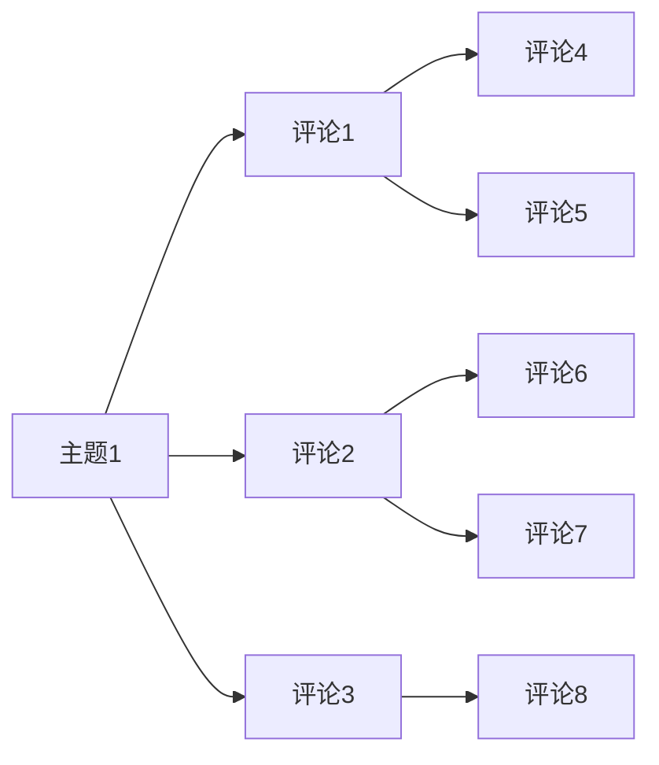
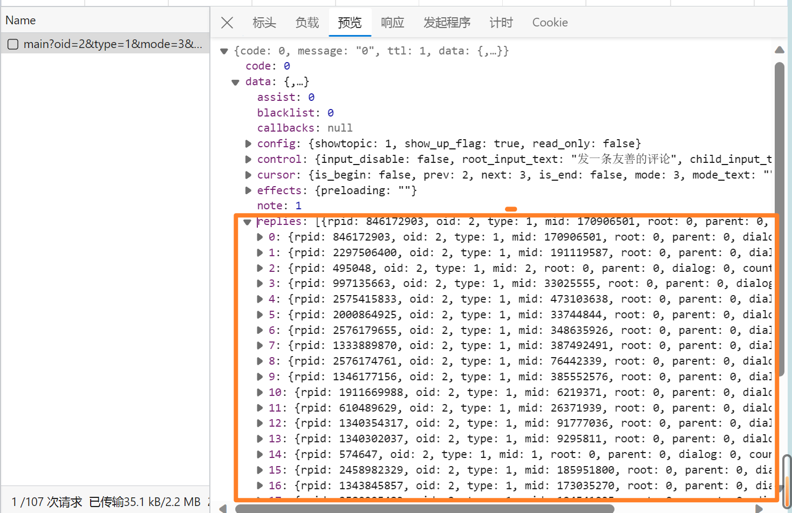
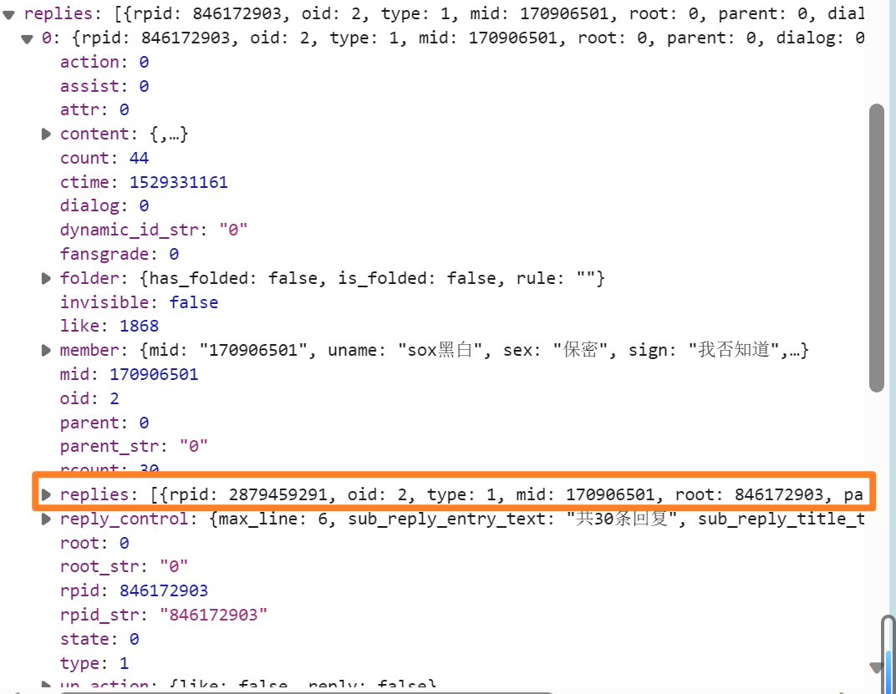
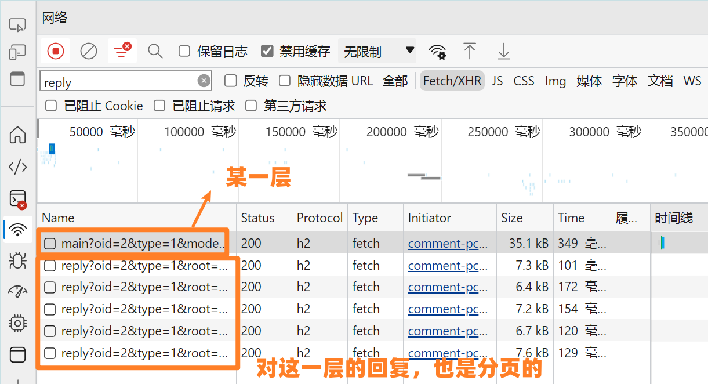
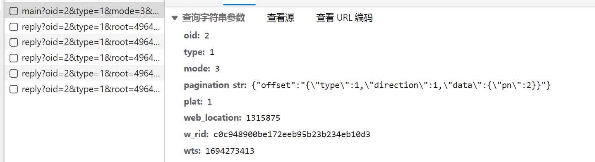

# 基于B站视频评论区构建对话数据集

> 本项目仅用于学习交流，不可用于商业用途，如有侵权请联系删除。爬虫程序务必遵守相关法律法规，本项目不承担任何责任。务必不要影响网站正常运行！

## 一些例子
最终完成构建的数据集，样例如下：
```json
[
  [
    {
      "from": "龙末",
      "value": "上学的时候，寝室六个人，蚊子只爱我，\n宁可趴在我蚊帐上对我垂涎三尺望眼欲穿，都不会去叮其他人趴其他人的蚊帐，"
    },
    {
      "from": "雾川鹤",
      "value": "我一样，宿舍四个人，只叮我，b型血"
    },
    {
      "from": "心琪爱糖",
      "value": "b血加一，一个屋里人家能骑着被子我得从头到脚裹严实"
    },
    {
      "from": "带个蓬箍会头疼",
      "value": "和血型无关，和糖分有关，一般胖人，或者懒人身上没肌肉都是那种软肉，糖分会高点，肌肉男运动型人不怎么招蚊子"
    },
    {
      "from": "龙末",
      "value": "我是176cm，55kg的肌肉女"
    },
    {
      "from": "带个蓬箍会头疼",
      "value": "55的176很瘦了，不过血糖也不是看体重，如果甜食吃的多血糖也多。我才163，体重50，血糖就体检有点多，皮和骨头直接没有肉，只有脂肪，不运动原因，"
    },
    {
      "from": "龙末",
      "value": "我特讨厌吃甜食，爱喝水不喝饮料，不吃肉，只吃鱼和蔬菜，血糖正常。[OK]"
    }
  ]
]
```

这个数据格式是 Aquila 做微调需要的，具体参见 [它们的 Github 仓库](https://github.com/FlagAI-Open/FlagAI/tree/master/examples/Aquila/Aquila-chat/data)。更多数据样例，请移步文章最后的仓库源码查看。

## 如何运行
1. 环境
- Python 3.7+ （自测环境为 Python 3.10.4）
- 使用 `pip install -r requirements.txt` 安装相关依赖
- 一个可用的 B 站账号

2. .env

由于 B 站限制，爬取相关内容需要登录，因此需要配置一下账号的 Cookie。  
克隆此项目后，在根目录下创建 .env 文件，内容如下：
```
SESSDATA='xxx'
BUVID3='xxxx'
DEDE_USER_ID='xxx'
BILI_JCT='xxx'
AT_TIME_VALUE='xxx'
```

各项值的含义和获取方式请参考 https://nemo2011.github.io/bilibili-api/#/get-credential 。

3. 按需修改参数

项目的主要文件只有一个, `bilibili_comments_crawler.py`，您可以配置的参数有：
```python
# 同时最多运行多少个协程，可调，但不建议改太大，不要给 B 站造成负担
ASYNC_POOL_MAX_SIZE = 16
# 对话链的最短有效长度，超过此长度的对话才会被保存
MIN_DIALOG_LENGTH = 5
# oid 即为视频的 av 号，可以在某个视频的源码中找到（右键-查看源代码-搜索 oid）
VIDEO_OID = 2
# 爬取每一页评论（即视频下面）后的休眠时间，单位秒
SLEEP_TIME_ONE_PAGE = 0.1
# 爬取每一条评论后的休眠时间，单位秒
SLEEP_TIME_ONE_REPLY = 0.1
# 被 B 站限制访问时的休眠时间，单位秒
SLEEP_TIME_WHEN_LIMITED = 30
# 被 B 站限制访问时的最高重试次数，超过此次数则放弃
MAX_RETRY_TIME_WHEN_LIMITED = 3
# 当某条数据已经爬过时，是否跳过，而不是重新爬取（对于新视频，有可能评论会随时间更新；老视频一般无影响）
SKIP_EXISTED_DATA = True
``` 

请按实际情况配置。

另外，项目生成的 json 格式为 `Aquila` 微调所需格式，如果需要改，可以自行修改 `build_conv_from_replies` 函数。

4. 跑起来
```bash
python bilibili_comments_crawler.py
```

下面是配套文章。

---

## 前言
前段时间，我的某个课程给我们提出了一个任务：自行构建数据集，微调 [Aquila-7B](https://model.baai.ac.cn/model-detail/100098) 大模型。上网搜了一圈，发现很多对话数据集是用的 GPT 系列的模型，而且数据集很多都是英文的，中文的数据集很少。作为 B 站用户，我突发奇想，想到了 B 站的视频评论区，这里的对话更加贴近生活，而且 B 站的视频评论区有很多热门视频，评论数也很多，能不能那它们来构建一个中文的对话数据集呢？

> 后记：由于时间关系，我最终没有用这个数据集来微调 Aquila-7B。不过既然折腾了这么久，我还是把这个项目写出来了，希望能对大家有所帮助。

## 基本思路
先不谈各种细节，我们先回顾下B站的评论区（或者各种视频网站的评论区），一般来说，评论区的对话是这样的：


因此每一层可以作为一个主题，其下每一条评论可以作为一个对话，默认情况下它是对这一层评论的回复，但是也有可能大家互相交流起来了。用数据结构的话，大概可以形成一棵树



这样，从树的根节点开始，到树的某一个叶子结点结束，就形成了一段对话。因此，我们的基本思路就是，从树的根节点开始，遍历树的所有叶子结点，每一条路径就是一段对话，我们把这些对话保存下来，按一定条件筛选，就构成了一个对话数据集。

思路有了，下面开始获取数据吧！

## 爬虫
### 基本结构
我们先来看看 B 站的评论区是怎么样的，打开一个视频，点击评论区，在 F12 开发者工具中，我们可以看到评论区的请求如下：



这是一个分页请求，每一页的接口返回的评论数据在 `data.replies` 中，其中每一条代表**一层**，有一个 `rpid` 字段，代表这一层的评论 ID。那每一层的评论又是怎样的呢？



里面还是 `replies` 字段，代表这一层的所有回复，结构与上面的一样。不过这一层下面就没有子层级了。打开 B 站页面，发现这个层中的评论也是按分页加载的。



也就是说，要爬取一个视频的所有评论，我们需要先获取第一层的评论，然后获取每一层的回复，直到没有回复为止。我们要做到两层的分页，第一层是获取视频下评论区某一页的评论，第二层是获取某一层的某一页的回复。这意味着，我们需要用一些方法来做到并行爬取，否则效率会很低。

### 协程和协程池
#### 协程
谈到并行，我们一般可能会想到线程，不过在线程之上还有更轻量的并发方式：协程。协程是一种用户态的“轻量级线程”，可以在一个线程中实现并发，协程的切换不需要操作系统的参与，因此效率很高。Python 3.4 之后的协程是通过 `asyncio` 模块实现的，我们可以通过 `async` 和 `await` 关键字来定义协程，通过 `asyncio.run()` 来运行协程。协程的执行需要一个事件循环，我们可以通过 `asyncio.get_event_loop()` 来获取一个事件循环，然后通过 `loop.run_until_complete()` 来运行协程。

举个栗子：
```python
import asyncio

async def main():
    print('Hello')
    await asyncio.sleep(1)
    print('World')

# 在 Python 高版本中，可以用 asyncio.run(main()) 来运行协程
# 或者低版本的：
# loop = asyncio.get_event_loop()
# loop.run_until_complete(main())
asyncio.run(main())
```

输出：
```
Hello （等待 1 秒后）
World 
```

#### 协程池
由于协程的轻量级，我们实际上可以同时运行大量的协程，但这无疑会给目标网站带来很大的压力，因此我们需要限制同时运行的协程数量。参照线程池，我们可以实现一个协程池，用来管理协程的运行。我们可以通过 `asyncio.Semaphore` 来实现一个协程池，它的用法与线程池的 `threading.Semaphore` 类似，我们可以通过 `semaphore.acquire()` 来获取一个信号量， `semaphore.release()` 来释放一个信号量、 `asyncio.wait()` 来等待一组协程的完成。具体的实现参照 [这篇博客](https://blog.csdn.net/weixin_43968923/article/details/111397237)

### 爬取评论
打开 F12，观察每一页的请求如下：



这里面的参数 `oid` 就是视频的 ID（其实也就是 av 号），`pagination_str` 用于控制分页。其他参数可以参考网友们维护的项目 [bilibili-api-collect](https://github.com/SocialSisterYi/bilibili-API-collect)。

#### 获取 Cookie
这里要注意的是，B 站的接口需要用户登录才能访问，因此我们需要先登录，然后获取登录后的 cookie，具体细节请参考
[这里的内容](https://socialsisteryi.github.io/bilibili-API-collect/docs/login/cookie_refresh.html)，并参照 [这里](https://nemo2011.github.io/bilibili-api/#/get-credential) 获取几个必要的 Cookie。我们将其保存到 `.env` 文件，并使用 `python-dotenv` 模块来读取。

```python
from dotenv import load_dotenv
import os

load_dotenv()

env = os.environ

SESSDATA = env.get('SESSDATA', '')
BILI_JCT = env.get('BILI_JCT', '')
BUVID3 = env.get('BUVID3', '')
DEDE_USER_ID = env.get('DEDE_USER_ID', '')
AT_TIME_VALUE = env.get('AT_TIME_VALUE', '')
```

#### 爬取一页评论
爬取评论的接口参数之前已经提到过了，无非就是根据参数写好 `params` 和 `cookies` ，再发网络请求就行了。这里我们使用 `httpx` 模块来发网络请求，它的用法与 `requests` 模块类似，不过它是异步的，因此我们需要用 `await` 来等待它的返回。

虽然说起来简单，但这一部分实际花了我比较多的时间，之前一直请求发现获取的是同一页数据，后来才发现是 `pagination_str` 需要对双引号做一定的转义。这里感谢 https://github.com/z0z0r4 提供的帮助，讨论的细节见 https://github.com/Nemo2011/bilibili-api/issues/462。

#### 爬取很多页评论
能获取一页数据了，那么下一页无非也就是 `pagination_str` 更改，它可以在响应中获取，如下
```json
{
    "code": 0,
    "message": "0",
    "ttl": 1,
    "data": {
        "cursor": {
            "is_begin": false,
            "prev": 2,
            "next": 3,
            "is_end": false,
            "name": "热门评论",
            "pagination_reply": {
                "next_offset": "{\"type\":1,\"direction\":1,\"data\":{\"pn\":3}}",
                "prev_offset": "{\"type\":1,\"direction\":2,\"data\":{\"pn\":2}}"
            },
            "session_id": ""
        },
        "replies": [...]
    }
}
```

使用循环不断更改 `pagination_str` ，直到 `cursor.is_end` 为 `true` 为止，就可以获取到所有的评论了。

一个可以完整运行的代码如下：
```python
import asyncio
import json
from traceback import print_exc
from typing import Any, Dict, List, Optional, TypeAlias

import httpx
from bilibili_api.credential import Credential

from async_pool import AsyncPool
# config 中包含了 BILI_JCT, SESSDATA, BUVID3, DEDE_USER_ID, AT_TIME_VALUE
from config import *

JSON_TYPE: TypeAlias = Dict[str, Any]

COMMON_HEADERS = {
    "Origin": "https://www.bilibili.com",
    "Authority": "api.bilibili.com",
    "Sec-Ch-Ua": '"Chromium";v="116", "Not)A;Brand";v="24", "Microsoft Edge";v="116"',
    "User-Agent": "Mozilla/5.0 (Windows NT 10.0; Win64; x64) AppleWebKit/537.36 (KHTML, like Gecko)"
}

# https://nemo2011.github.io/bilibili-api/#/get-credential
if not (SESSDATA and BILI_JCT and BUVID3 and DEDE_USER_ID and AT_TIME_VALUE):
    raise ValueError(
        "请在 .env 中填写 SESSDATA, BILI_JCT, BUVID3, DEDE_USER_ID, AT_TIME_VALUE")

credential = Credential(sessdata=SESSDATA, bili_jct=BILI_JCT,
                        buvid3=BUVID3, dedeuserid=DEDE_USER_ID, ac_time_value=AT_TIME_VALUE)
print("credential: ", credential.get_cookies())
pool = AsyncPool(maxsize=16)


async def get_html(url: str, params: Dict = None, headers: Dict = None, cookies: Dict = None, timeout: int = 30, client: httpx.AsyncClient = None):
    m_client = client
    try:
        if client is None:
            m_client = httpx.AsyncClient()
        # print("当前发送请求的 client ID: ", id(m_client))
        r = await m_client.get(url, timeout=timeout, params=params, headers=headers, cookies=cookies)
        r.raise_for_status()  # 如果状态不是200，引发HTTPError异常
        return r.text
    except Exception as e:
        print_exc()
        return "产生异常"
    finally:
        if client is None and m_client is not None:
            await m_client.aclose()


async def get_one_page(oid: int, pagination_str: str, client: httpx.AsyncClient = None):
    """获取范围：一个回复页"""
    params = {
        "type": 1,
        "oid": oid,
        "mode": 2,
        "pagination_str": '{"offset":"%s"}' % pagination_str.replace('"', r"\""),
    }
    # pagination_str: {"offset":"{\"type\":1,\"direction\":1,\"session_id\":\"1733963713068881\",\"data\":{}}"}
    url = "https://api.bilibili.com/x/v2/reply/main"
    # print("-- url: ", url + "?" + urlencode(params))
    text = await get_html(url, params, COMMON_HEADERS, cookies=credential.get_cookies(), client=client)
    obj = json.loads(text)
    return obj


async def crawl_one_page_video(oid: int, page: int, pagination_str: str, client: httpx.AsyncClient) -> Optional[str]:
    """
    爬取一个视频一页的评论，返回下一页的 pagination_str
    """

    print("-- 开始爬取视频 {} 的第 {} 页评论".format(oid, page))
    obj = await get_one_page(oid, pagination_str, client)

    if obj["code"] != 0:
        print("爬取视频 {} 的第 {} 页评论失败，原因是 {} (code={})".format(
            oid, page, obj["message"], obj["code"]))
        return None
    video_replies = obj["data"]["replies"]

    print("爬取到的第 {} 页，第一条评论是 {}".format(
        page, video_replies[0]["content"]["message"]))
    return obj["data"]["cursor"]["pagination_reply"].get("next_offset")


async def crawl_one_video(oid: int):
    """
    爬取一个视频的所有评论
    """
    print("- 开始爬取视频 {} 的评论".format(oid))
    url = "https://api.bilibili.com/x/v2/reply/count"
    params = {
        "type": 1,
        "oid": oid
    }
    text = await get_html(url, params, COMMON_HEADERS)
    obj = json.loads(text)
    total_page: int = obj["data"]["count"] // 20 + 1
    print("- 视频 {} 一共有 {} 页评论".format(oid, total_page))
    pagination = ''
    async with httpx.AsyncClient() as client:
        for page in range(1, total_page + 1):
            next_page = await crawl_one_page_video(oid, page, pagination_str=pagination, client=client)

            print("-- 爬取视频 {} 的第 {} 页评论完毕，下一页: {}".format(oid, page, next_page))
            if next_page is None:
                print("- 视频 {} 的评论爬取完毕".format(oid))
                break
            await asyncio.sleep(0.1)
            pagination = next_page


async def refresh_cookie_if_necessary():
    need_refresh = await credential.check_refresh()
    if need_refresh:
        print("cookie 已过期，正在刷新")
        await credential.refresh()
        print("cookie 刷新成功")
    else:
        print("cookie 未过期，无需刷新")


async def main():
    await refresh_cookie_if_necessary()
    await crawl_one_video(2)

if __name__ == "__main__":
    asyncio.run(main())
```

正常运行的输出如下：

```
cookie 未过期，无需刷新
- 开始爬取视频 2 的评论
- 视频 2 一共有 4156 页评论
-- 开始爬取视频 2 的第 1 页评论
爬取到的第 1 页，第一条评论是 9月9
-- 爬取视频 2 的第 1 页评论完毕，下一页: {"type":3,"direction":1,"Data":{"cursor":68500}}
-- 开始爬取视频 2 的第 2 页评论
爬取到的第 2 页，第一条评论是 考古
-- 爬取视频 2 的第 2 页评论完毕，下一页: {"type":3,"direction":1,"Data":{"cursor":68468}}
-- 开始爬取视频 2 的第 3 页评论
爬取到的第 3 页，第一条评论是 我来自2023年，只是埋一个时间胶囊
-- 爬取视频 2 的第 3 页评论完毕，下一页: {"type":3,"direction":1,"Data":{"cursor":68445}}
-- 开始爬取视频 2 的第 4 页评论
爬取到的第 4 页，第一条评论是 考古，这个视频都要成骨灰了
...
```

要运行上面的文件，你需要安装 `httpx`、`bilibili-api-python` 和 `python-dotenv` 模块，然后在 `.env` 文件中填写好相关参数，并且复制协程池的代码为 `async_pool.py` 文件。然后运行


### 构建数据集
数据的获取大概如上，下一步就是把爬到的东西构造数据集。我们先看看目前爬到的每一个 `replies` 里面都是个啥

```json
[
    {
        "rpid": 476670,
        "oid": 2,
        "type": 1,
        "mid": 58426,
        "root": 0,
        "parent": 0,
        "dialog": 0,
        "count": 3303,
        "rcount": 3002,
        "state": 0,
        "fansgrade": 0,
        "attr": 0,
        "ctime": 1291350931,
        "rpid_str": "476670",
        "root_str": "0",
        "parent_str": "0",
        "like": 106140,
        "action": 0,
        "member": {
            "mid": "58426",
            "uname": "残星什么的就是残星",
            "sex": "男",
            "sign": "少说话多做事 _微博@残星",
            // 省略其他一大堆的信息
        },
        "content": {
            "message": "貌似没人来",
            "members": [],
            "jump_url": {},
            "max_line": 6
        },
    }
]
```

如上所示，每一条的评论会包含大量信息，其中我们关注的主要有下面几个：
- `rpid`：评论 ID
- `parent` 和 `root`：这两个字段代表这条评论的父评论和根评论，如果 `parent` 为 0，那么这条评论就是根评论，否则就是回复
- `member.uname`：评论者的用户名
- `content.message`：评论的内容

先提取这些信息，处理成如下形式：
```json
{
    476670: {'parent': 0, 'content': '貌似没人来', 'uname': '残星什么的就是残星'},
    214198179: {'parent': 476670, 'content': '可怜的二楼(=・ω・=)', 'uname': '初音ハク'},
    214198733: {'parent': 476670, 'content': '划了4千多条评论找到的啊ε=ε=(ノ≧∇≦)ノ', 'uname': '初音ハク'},
    225269192: {'parent': 476670, 'content': '可怜二楼没人', 'uname': '御坂妹妹10492號'},
    451059061: {'parent': 476670, 'content': '好可怜啊(=・ω・=)', 'uname': '废爪萌狼'},
    451154733: {'parent': 451059061, 'content': '回复 @负能量使者:你你你..你是怎么找到这里来的Σ(ﾟдﾟ;)', 'uname': '御坂妹妹10492號'},
    454929344: {'parent': 476670, 'content': '二楼！找到你了ε=ε=(ノ≧∇≦)ノ', 'uname': 'JIKOPPHU'},
    462379015: {'parent': 476670, 'content': '手好疼。。。', 'uname': 'SCP-1762龙在此'}
}
```

每一个键值对代表一条评论，键是评论 ID，值是一个字典，包含了评论的父评论 ID、评论内容和评论者用户名。这样，我们就可以根据 `parent` 来逐级找到它的父评论。

接下来，我们根据 `rpid` 构建一棵树，对于每一个评论 ID，找到它的子评论，作为它的子节点。对于上面的例子，会形成这样的一个结构：

```python
{ 
    0: [476670], 
    476670: [214198179, 214198733, 225269192, 451059061, 454929344, 462379015], 
    451059061: [451154733]
}
```

根据这棵树，我们就可以找到根节点，然后遍历树的所有叶子结点，每一条完整路径就是一段对话。我们把这些对话保存下来，就构成了一个对话数据集。

在这个过程中，我们可以根据需要做一些剪枝和过滤，以提高最终获得数据集的质量。比如仅保留对话长度在 n 之上的对话、或者对多个类似的回复去重、处理表情等等。在这里，我们只做简单的处理，保留对话长度在 5 以上的对话.

上述过程的完整代码如下（数据是我现编的，由于对话链较短，最小阈值设为了3）：
```python

from typing import List, Dict

replies_dict = {
    1: {'parent': 0, 'content': '一楼', 'uname': '1'},
    2: {'parent': 1, 'content': '二楼', 'uname': '2'},
    3: {'parent': 2, 'content': '三楼', 'uname': '3'},
    4: {'parent': 2, 'content': '我也抢三楼', 'uname': '4'},
    5: {'parent': 4, 'content': '你抢失败了哈哈', 'uname': '5'},
    6: {'parent': 5, 'content': '怎么无情嘲笑', 'uname': '6'},
    7: {'parent': 5, 'content': '哈哈哈哈，有点离谱', 'uname': '7'},
    8: {'parent': 4, 'content': '有点慢哈', 'uname': '8'},
}

# 从评论列表构建多条对话数据集
# [[{'from': '3', 'value': '三楼'}, {'from': '2', 'value': '二楼'}, {'from': '1', 'value': '一楼'}], [{'from': '6', 'value': '怎么无情嘲笑'}, {'from': '5', 'value': '你抢失败了哈哈'}, {'from': '4', 'value': '我也抢三楼'}, {'from': '2', 'value': '二楼'}, {'from': '1', 'value': '一楼'}], [{'from': '7', 'value': '哈哈哈哈，有点离谱'}, {'from': '5', 'value': '你抢失败了哈哈'}, {'from': '4', 'value': '我也抢三楼'}, {'from': '2', 'value': '二楼'}, {'from': '1', 'value': '一楼'}], [{'from': '8', 'value': '有点慢哈'}, {'from': '4', 'value': '我也抢三楼'}, {'from': '2', 'value': '二楼'}, {'from': '1', 'value': '一楼'}]]
def build_conv_from_replies(replies_dict) -> List[List[Dict]]:
    conv_tree = {}

    # 构建对话树
    for reply_id, reply in replies_dict.items():
        parent_id = reply['parent']
        if parent_id in conv_tree:
            conv_tree[parent_id].append(reply_id)
        else:
            conv_tree[parent_id] = [reply_id]

    print(conv_tree)
    longest_paths = []
    path = []

    # DFS遍历所有根节点到叶子节点的路径
    def dfs(node):
        nonlocal path
        path.append(node)
        if node not in conv_tree:
            # 当前节点是叶子节点，保存路径
            longest_paths.append(path.copy())
        else:
            for child in conv_tree[node]:
                dfs(child)
        path.pop()

    # 从每个根节点开始进行DFS搜索
    for root in conv_tree[0]:
        dfs(root)

    # 根据路径获取对话链
    longest_conversations = []
    for path in longest_paths:
        conversation = []
        for node in path:
            conversation.append(replies_dict[node])
        longest_conversations.append(conversation)

    conv = longest_conversations
    # print(conv)

    conversations = []
    for c in conv:
        # 过滤：
        # 1. 评论数小于 3 的对话
        if len(c) <= 2:
            continue
        temp = []
        for item in reversed(c):
            content = item['content']
            if content.startswith('回复 @'):
                content = content.split(':')[1]
            temp.append({
                'from': item['uname'],
                'value': content
            })
        conversations.append(temp)
    
    return conversations

import json
t = (build_conv_from_replies(replies_dict))
with open('test.json', 'w', encoding='utf-8') as f:
    json.dump(t, f, ensure_ascii=False, indent=4)
```

至此，完成！

## 总结（By Github Copilot）
本文主要介绍了如何从 B 站的视频评论区构建一个对话数据集，主要思路是先爬取评论，然后根据评论的父评论构建一棵树，然后从根节点开始遍历树的所有叶子结点，每一条路径就是一段对话，最后保存下来就构成了一个对话数据集。这个数据集可以用于微调大预言模型，也可以用于其他对话生成任务。

本文只是简单示例，我没有验证过这个数据集的质量，也没有做过其他的处理，因此大家可以根据自己的需求来做一些剪枝和过滤，以提高最终获得数据集的质量。

本文的代码已经上传到了 Github，欢迎大家 Star 和 Fork，如果有什么问题，欢迎提 Issue。